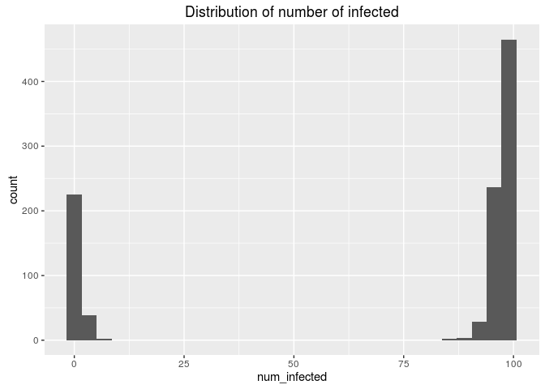
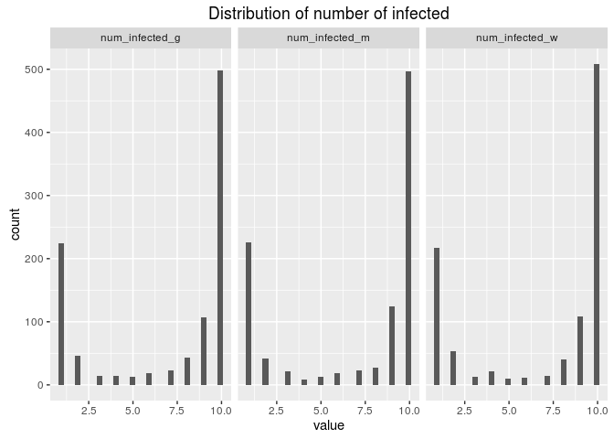
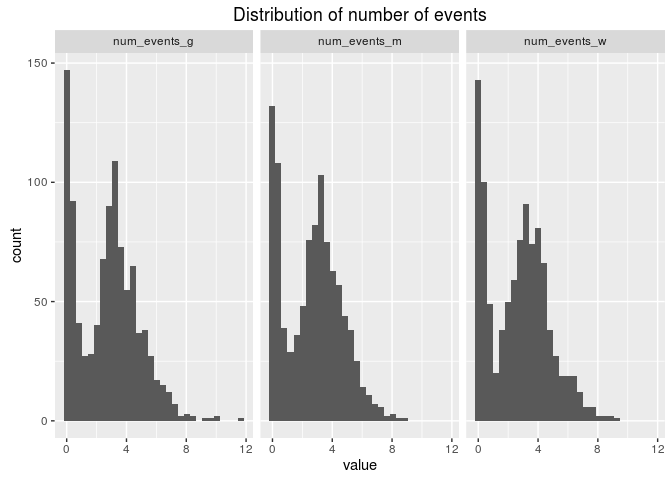

# lab-01_simulation
daniel  
July 20, 2016  


```r
if (interactive()) {
    f <- 'sismid_11-mcmc2_for_infectious_diseases/lab-01_simulation/simulation.R'
    f2 <- 'sismid_11-mcmc2_for_infectious_diseases/lab-01_simulation/simulation_2.R'
} else {
    f <- 'simulation.R'
    f2 <- 'simulation_2.R'
}
```


```r
library(ggplot2)
library(tidyr)
library(tibble)

source(f)
source(f2)

set.seed(42)
```


# Exercise 1
Go through the lines of each function and make sure that you follow the logic behind.

# Exercise 2
Simulate realisations from a Markovian SIR using the function `simSIR.Markov` and make sure that you understand the output. You may assume that size of the population size is $N=21$ (i.e. 20 susceptibles and 1 initial infective). In addition, you could try different values for $(β,γ)$, e.g. $(0.9,1)$,$(2,1)$and $(4,1)$.


```r
simSIR.Markov(N = 21, beta = 0.9, gamma = 1)
```

```
## $t
## [1] 0.0000000 0.1067967
## 
## $type
## [1] 1 2
```


```r
simSIR.Markov(N = 21, beta = 2, gamma = 1)
```

```
## $t
##  [1] 0.00000000 0.09759528 0.18180468 0.22036419 0.43986905 0.61101467
##  [7] 0.71814837 0.72285413 0.74498382 0.79830756 0.82588603 0.87027484
## [13] 0.99527161 1.01086863 1.05690809 1.08344823 1.09944568 1.16756263
## [19] 1.20172576 1.23051200 1.34228348 1.34405868 1.37065822 1.42189385
## [25] 1.44987524 1.67247738 1.77909639 2.09738993 2.09981042 2.11335733
## [31] 2.21646372 2.27242788 2.43741896 2.48109544 2.73795219 2.77093332
## [37] 2.85225820 2.90275634 3.31672897 3.47663249 3.51239378 3.73026868
## 
## $type
##  [1] 1 1 1 2 1 1 1 1 2 1 1 1 2 1 1 2 1 1 1 2 1 2 1 2 1 1 2 2 1 2 2 2 2 1 2
## [36] 2 2 2 2 2 2 2
```


```r
simSIR.Markov(N = 21, beta = 4, gamma = 1)
```

```
## $t
##  [1] 0.0000000 0.1045935 0.1123419 0.6130533 0.6262825 0.7143751 0.7234516
##  [8] 0.7462308 0.7535884 0.7707786 0.7900479 0.8130486 0.8766086 0.9225710
## [15] 0.9977749 1.0404458 1.0606518 1.0852010 1.1005090 1.1904731 1.2591667
## [22] 1.2789519 1.2825616 1.3224808 1.3468461 1.4249075 1.4750373 1.5166692
## [29] 1.5341462 1.5731316 1.5814969 1.7825697 1.9536197 2.2218787 2.2298473
## [36] 2.2993295 2.3590685 2.6889356 2.7326833 2.8326005 4.3753073 4.4701594
## 
## $type
##  [1] 1 1 1 1 2 1 1 1 1 2 1 1 1 2 2 1 1 1 2 1 2 1 1 1 2 2 2 2 1 2 2 2 1 1 2
## [36] 2 2 2 2 2 2 2
```

# Exercise 3
Modify the existing functions in simulation.R to record the final size and the duration of the epidemic as part of the functions’ output.


```r
simSIR.Markov2(N = 21, beta = 4, gamma = 1)
```

```
## $t
##  [1] 0.0000000 0.1688553 0.2382450 0.3789919 0.4672698 0.4702352 0.5636390
##  [8] 0.6497815 0.6533501 0.7095548 0.7361686 0.8563020 0.9407703 0.9551624
## [15] 0.9861125 0.9861143 0.9911903 1.0487226 1.0824613 1.1236232 1.1640933
## [22] 1.2463970 1.2939896 1.3285540 1.3531290 1.4221429 1.5739638 1.5875208
## [29] 1.7844412 1.8405687 1.8498174 1.9357783 1.9422298 2.0400668 2.0773523
## [36] 2.2947188 2.3163262 2.5416757 2.6528804 2.6534298 2.8287494 2.8964070
## 
## $type
##  [1] 1 1 1 1 1 1 1 1 1 1 1 2 1 1 2 1 2 2 1 1 1 2 1 2 1 2 2 1 2 2 2 1 2 2 2
## [36] 2 2 2 2 2 2 2
## 
## $num_infected
## [1] 21
## 
## $num_events
## [1] 2.896407
```


# Exercise 4
Derive a simulation-based estimate of the distribution of the final size of a Markovian SIR model for different values of R0R0, e.g. R0=0.9R0=0.9, R0=1.5R0=1.5 and R0=4R0=4. Furthermore, do the same for the non-Markovian models, e.g. for a constant and a Gamma infectious period. Hint: You may find it useful to write a loop which will iterate the following steps for a number of times:

Simulate a realisation from the epidemic model;
Store the final size
At the end you should have a collection of final sizes for which then you can plot a histogram as your estimate of the true distribution of the final size.


```r
sim_results <- list()
for (i in 1:1000) {
    sim <- simSIR.Markov2(N = 100, beta = 4, gamma = 1)
    sim_results <- append(sim_results, list(sim))
}
```


```r
num_infected <- sapply(X = sim_results, FUN = '[[', 'num_infected')
# num_infected
```


```r
ggplot(data = data.frame(num_infected), aes(x = num_infected)) + geom_histogram() +
    ggtitle('Distribution of number of infected')
```

```
## `stat_bin()` using `bins = 30`. Pick better value with `binwidth`.
```

<!-- -->

# Exercise 5
Repeat the above exercise but derive, by simulation, the distribution of the duration of the epidemic instead of the final size.


```r
num_events <- sapply(X = sim_results, FUN = '[[', 'num_events')
# num_events
```


```r
ggplot(data = data.frame(num_events), aes(x = num_events)) + geom_histogram() +
    ggtitle('distribution of number of events')
```

```
## `stat_bin()` using `bins = 30`. Pick better value with `binwidth`.
```

<!-- -->

# Exercise 6
Write a function in R to simulate from a non-Markovian stochastic epidemic model where the infectious period is assumed to follow a Weibull distribution. Hint: The probability density function (pdf) of the Weibull distribution is as follows:

$f(x)=(a/b)(x/b)(a−1)exp(−(x/b)a),x>0,a>0,b>0$

$f(x)=(a/b)(x/b)(a−1)expa(−(x/b)a),x>0,a>0,b>0$

Type `?Weibull` to find out how to simulate from a Weibull distribution.


## Compare markov, gamma, weibull


```r
sim_results_markov <- list()
sim_results_gamma <- list()
sim_results_weibull <- list()

sim_N <- 10
sim_b <- 4
sim_g <- 1
sim_d <- 1
total_time <- 1000

for (i in 1:total_time) {
    sim_markov <- simSIR.Markov2(N = sim_N, beta = sim_b, gamma = sim_g)
    sim_results_markov <- append(sim_results_markov, list(sim_markov))
    
    sim_gamma <- simSIR.Non.Markov.gamma2(N = sim_N, beta = sim_b, gamma = sim_g, delta = sim_d)
    sim_results_gamma <- append(sim_results_gamma, list(sim_gamma))
    
    sim_weibull <- simSIR.Non.Markov.weibull(N = sim_N, beta = sim_b, gamma = sim_g, delta = sim_d,
                                             shape = 1, scale = 1)
    sim_results_weibull <- append(sim_results_weibull, list(sim_weibull))
}
```

### Num infected


```r
num_infected_m <- sapply(X = sim_results_markov, FUN = '[[', 'num_infected')
num_infected_g <- sapply(X = sim_results_gamma, FUN = '[[', 'num_infected')
num_infected_w <- sapply(X = sim_results_weibull, FUN = '[[', 'num_infected')
```


```r
num_infected_df <- data.frame(num_infected_m, num_infected_g, num_infected_w)
num_infected_df <- num_infected_df %>%
    gather(key = dist, value = value)

num_infected_df$time <- rep(1:total_time, times = 3)
```


```r
ggplot(data = num_infected_df, aes(x = value)) + geom_histogram() +
    facet_wrap(~dist) + 
    ggtitle('Distribution of number of infected')
```

```
## `stat_bin()` using `bins = 30`. Pick better value with `binwidth`.
```

<!-- -->

### Num events


```r
num_events_m <- sapply(X = sim_results_markov, FUN = '[[', 'num_events')
num_events_g <- sapply(X = sim_results_gamma, FUN = '[[', 'num_events')
num_events_w <- sapply(X = sim_results_weibull, FUN = '[[', 'num_events')
```


```r
num_events_df <- data.frame(num_events_m, num_events_g, num_events_w)
num_events_df <- num_events_df %>%
    gather(key = dist, value = value)

num_events_df$time <- rep(1:total_time, times = 3)
```


```r
ggplot(data = num_events_df, aes(x = value)) + geom_histogram() +
    facet_wrap(~dist) + 
    ggtitle('Distribution of number of events')
```

```
## `stat_bin()` using `bins = 30`. Pick better value with `binwidth`.
```

<!-- -->

# Exercise 7
Write a function to simulate from an epidemic model which involves a fixed latent period, i.e. write a function to simulate from a stochastic SEIR model.


```r
simSIR.Non.Markov.constant(N = 25, beta = 32, k = 10)
```

```
## $t
##  [1]  0.00000000  0.04119218  0.05817399  0.06137456  0.06879201
##  [6]  0.07116893  0.07773405  0.08771696  0.09840664  0.10916477
## [11]  0.11307382  0.11822569  0.11949548  0.12255181  0.12573904
## [16]  0.13446084  0.13701855  0.14302067  0.14573050  0.14678120
## [21]  0.15593473  0.15870151  0.16321874  0.16939290  0.28247988
## [26] 10.00000000 10.04119218 10.05817399 10.06137456 10.06879201
## [31] 10.07116893 10.07773405 10.08771696 10.09840664 10.10916477
## [36] 10.11307382 10.11822569 10.11949548 10.12255181 10.12573904
## [41] 10.13446084 10.13701855 10.14302067 10.14573050 10.14678120
## [46] 10.15593473 10.15870151 10.16321874 10.16939290 10.28247988
## 
## $type
##  [1] 1 1 1 1 1 1 1 1 1 1 1 1 1 1 1 1 1 1 1 1 1 1 1 1 1 2 2 2 2 2 2 2 2 2 2
## [36] 2 2 2 2 2 2 2 2 2 2 2 2 2 2 2
## 
## $labels
##  [1]  1  2  3  4  5  6  7  8  9 10 11 12 13 14 15 16 17 18 19 20 21 22 23
## [24] 24 25  1  2  3  4  5  6  7  8  9 10 11 12 13 14 15 16 17 18 19 20 21
## [47] 22 23 24 25
```

